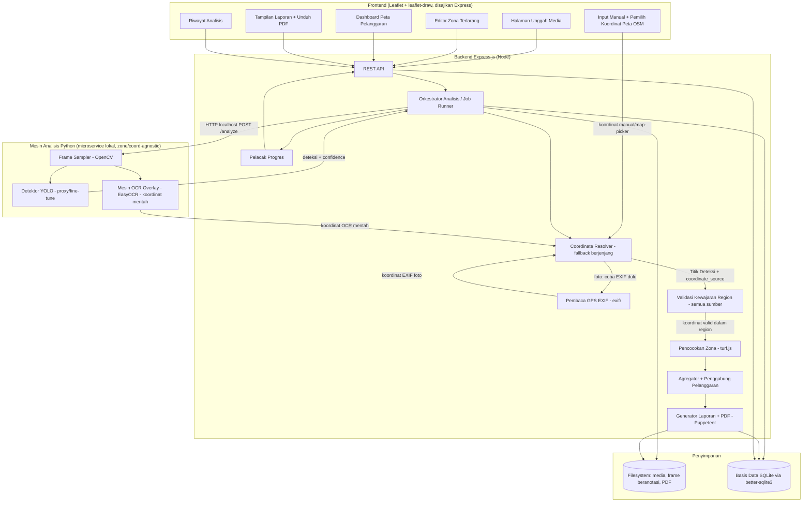
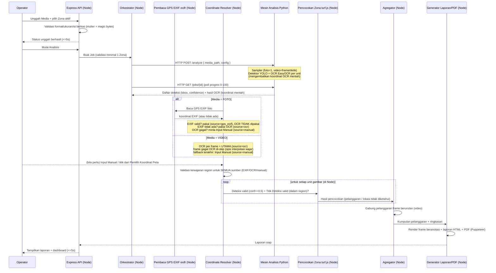
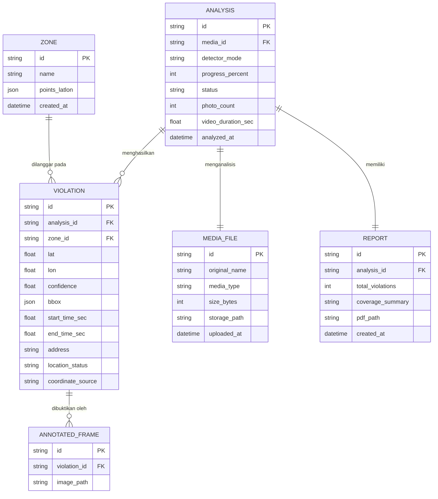

# Design Document

## Overview

Dokumen ini menjelaskan rancangan teknis Sistem pemantauan ketertiban ruang publik berbasis zona untuk mendeteksi PKL dan menghasilkan laporan pelanggaran yang tervalidasi lokasi. Rancangan mengikuti dan memenuhi seluruh persyaratan pada `requirements.md`.

Prinsip desain utama yang menjadi penggerak arsitektur:

1. **Batch, bukan realtime.** Analisis dijalankan sebagai *job* yang diproses setelah unggahan selesai. Ini menyederhanakan penanganan progres, kegagalan, dan penyimpanan hasil, serta sesuai batasan waktu lomba (4 minggu, demo 75%).
2. **Foto adalah jalur utama; video = kumpulan foto.** Satu foto memiliki satu Titik Deteksi. Video diperlakukan sebagai deret Frame Disampel (1 frame/detik), dan **setiap Frame Disampel diproses dengan pipeline yang identik dengan foto**. Konsekuensinya, seluruh logika inti (OCR, deteksi, pencocokan zona) ditulis satu kali untuk unit "gambar + koordinat" dan dipakai ulang.
3. **Perolehan koordinat berjenjang (tiered fallback) sesuai jenis Media.** Sumber koordinat tidak tunggal, melainkan dipilih berjenjang oleh sebuah **Coordinate Resolver** di sisi Node:
   - **Foto**: metadata **GPS EXIF adalah sumber UTAMA**. Bila EXIF GPS valid tersedia, koordinat itu dipakai langsung dan **OCR TIDAK dijalankan** untuk foto tersebut. Bila EXIF hilang/tidak valid → jatuh ke **OCR** pada Overlay Koordinat. Bila OCR juga gagal/tidak valid → jatuh ke **Input Manual**.
   - **Video**: GPS EXIF tidak tersedia per-frame, sehingga video **melewati EXIF** dan memakai **OCR per Frame Disampel sebagai sumber UTAMA**; frame yang gagal OCR di-skip (dengan opsi interpolasi wajar antar-frame bertetangga), dan **Input Manual** menjadi cadangan TERAKHIR untuk Media.
   - **Input Manual** mencakup pengetikan teks koordinat maupun **Pemilih Koordinat Peta** (peta OpenStreetMap interaktif: klik titik → tampil koordinat → pilih/salin → isi kolom manual).
   - **Validasi kewajaran region** (dalam `region_bounds`) berlaku untuk **semua sumber** (GPS EXIF, OCR, manual/map-picker); koordinat di luar region ditandai tidak valid apa pun sumbernya dan tidak pernah dipakai untuk Pencocokan Zona.
4. **Zona geografis, bukan piksel.** Zona Terlarang adalah poligon lintang/bujur di atas peta OpenStreetMap. Pencocokan pelanggaran adalah operasi geometri geografis (point-in-polygon) yang **deterministik dan tidak berbasis AI**.
5. **Deteksi hybrid yang dapat dikonfigurasi.** Detektor punya dua mode — proxy (YOLO pretrained + aturan "person di dalam zona") dan fine-tune (YOLO dilatih pada dataset PKL) — yang dapat ditukar via konfigurasi tanpa mengubah alur analisis lain.
6. **Pemisahan tanggung jawab yang tegas.** Deteksi (CV), pembacaan koordinat (OCR), geometri (pencocokan zona), dan pelaporan adalah komponen terpisah yang berkomunikasi lewat struktur data eksplisit, sehingga tiap bagian dapat diuji dan diganti secara independen.

### Arsitektur Hybrid Node.js + Python

Rancangan ini menggunakan **arsitektur hybrid** dengan dua runtime:

- **Express.js (Node.js)** sebagai backend utama: melayani REST API, unggah media, CRUD Zona Terlarang, **pembacaan GPS EXIF foto (exifr)**, **Coordinate Resolver (orkestrasi fallback koordinat berjenjang)**, orkestrasi job analisis + pelacakan progres, pengambilan laporan, riwayat, dan menyajikan frontend (Leaflet + leaflet-draw, termasuk Pemilih Koordinat Peta).
- **Mesin Analisis Python** sebagai pekerja komputasi berat: deteksi YOLO (Ultralytics, mode proxy + fine-tune) dan pembacaan overlay dengan EasyOCR. Mesin ini **zone-agnostic dan koordinat-agnostic**: ia mengembalikan deteksi mentah + koordinat OCR mentah, sedangkan penentuan sumber koordinat final dan pencocokan zona diputuskan di Node. Express memanggil mesin ini melalui **batas integrasi** yang jelas (lihat di bawah).

Pembacaan GPS EXIF sengaja diletakkan **di sisi Node** karena: (a) foto sudah ditangani Express/`multer` saat unggah sehingga berkas telah berada di Node; (b) parsing EXIF bersifat ringan (I/O metadata, bukan komputasi berat) sehingga tidak perlu melintasi batas HTTP; dan (c) menjaga mesin Python tetap fokus pada YOLO+OCR. *Alternatif*: pembacaan EXIF bisa saja ditaruh di mesin Python (mis. via `piexif`/`Pillow`), tetapi kami memilih Node dengan rasional di atas.

Pemisahan ini memungkinkan bagian API/orkestrasi/frontend memakai ekosistem Node yang produktif untuk web, sementara pekerjaan CV/OCR tetap pada ekosistem Python yang matang untuk machine learning.

### Pilihan Teknologi (hasil riset)

| Kebutuhan | Pilihan | Runtime | Alasan |
|-----------|---------|---------|--------|
| Backend API & orkestrasi job | Express.js (Node.js) | Node | Backend utama: REST API, unggah, CRUD zona, orkestrasi/progres job, laporan, riwayat, dan penyajian frontend. Ekosistem web matang, non-blocking I/O cocok untuk unggah + polling progres. |
| Deteksi objek (proxy & fine-tune) | Ultralytics YOLO (v8) via Python | Python | Satu API untuk pretrained (kelas `person` dari COCO) dan model hasil fine-tune; matang, dokumentasi lengkap, mendukung inferensi batch. Tetap di Python karena ekosistem ML. |
| Pembacaan GPS EXIF foto | `exifr` (library EXIF Node) | Node | Sumber koordinat UTAMA untuk foto; berjalan di Node karena foto sudah ditangani Express/`multer` saat unggah dan parsing EXIF ringan. Alternatif di Python (`piexif`/`Pillow`) dicatat namun tidak dipilih agar mesin Python tetap fokus CV/OCR. |
| OCR overlay koordinat | EasyOCR (utama) dengan Tesseract sebagai alternatif | Python | Sumber koordinat UTAMA untuk video (GPS EXIF tak tersedia per-frame) dan CADANGAN untuk foto (bila GPS EXIF hilang/tidak valid). Overlay berupa teks tercetak dengan latar semi-transparan; EasyOCR tangguh pada teks in-the-wild. Praproses (crop area overlay, grayscale, threshold) meningkatkan akurasi. Konten dirangkum ulang untuk kepatuhan lisensi. |
| Geometri point-in-polygon + validasi poligon | turf.js (`@turf/boolean-point-in-polygon`, `@turf/boolean-valid`) | Node | Dijalankan di sisi Node agar cohesive dengan editor zona (leaflet-draw) dan pencocokan pelanggaran di orkestrator; lihat rasional di bawah. |
| Peta interaktif + gambar poligon | Leaflet + leaflet-draw di atas tile OpenStreetMap | Node (frontend) | Library peta open-source populer; leaflet-draw menyediakan alat menggambar poligon; mendukung marker/popup untuk dashboard. Disajikan oleh Express. |
| Penyimpanan metadata & riwayat | SQLite via `better-sqlite3` (driver Node) | Node | Ringan, tanpa server, cukup untuk skala demo; API sinkron `better-sqlite3` sederhana dan cepat. Prisma+SQLite adalah alternatif bila perlu ORM & migrasi terstruktur. |
| Berkas media & artefak | Filesystem lokal (folder `storage/`) | Node | Sederhana dan cukup untuk batch demo; path direferensikan dari DB. Dibaca-bersama oleh mesin Python (path lokal). |
| Generasi PDF | Puppeteer (HTML → PDF) di Node | Node | Template laporan sudah berupa HTML yang disajikan Express; Puppeteer merender HTML+gambar beranotasi ke PDF dengan hasil setia. `pdfkit` adalah alternatif tanpa headless browser. |

**Rasional batas integrasi Node ↔ Python (rekomendasi: local Python microservice).** Untuk timeline lomba 4 minggu, ada dua opsi memanggil mesin analisis Python dari Express:

- **Child process (`spawn`)**: Express menjalankan skrip Python per-job, mengirim argumen/JSON via stdin dan menerima hasil via stdout. Sederhana, tanpa server tambahan, tapi menanggung biaya *cold start* (memuat model YOLO/EasyOCR tiap proses) dan sulit melaporkan progres bertahap.
- **Local Python microservice (rekomendasi)**: sebuah worker Python kecil (FastAPI/Flask) berjalan di `localhost`, memuat model **sekali** saat start, lalu Express memanggilnya via HTTP (`POST /analyze`) dan mem-*poll* progres (`GET /jobs/{id}`). 

Kami merekomendasikan **local Python microservice** karena model YOLO/EasyOCR mahal dimuat; menjaga proses tetap hidup menghindari cold start berulang dan memberi kanal alami untuk melaporkan progres bertahap (Req 4.6). Express tetap menjadi satu-satunya *entry point* publik; worker Python hanya diakses lokal.

> Catatan kepatuhan: ringkasan riset di atas telah diparafrasekan dari sumber publik (dokumentasi Ultralytics, Leaflet, turf.js, Express, better-sqlite3, Puppeteer, exifr, serta artikel OCR overlay). Content was rephrased for compliance with licensing restrictions. Sumber: [Ultralytics YOLO docs](https://docs.ultralytics.com/), [Leaflet](https://leafletjs.com/), [Turf.js](https://turfjs.org/), [Express](https://expressjs.com/), [better-sqlite3](https://github.com/WiseLibs/better-sqlite3), [Puppeteer](https://pptr.dev/), [exifr](https://github.com/MikeKovarik/exifr), [EasyOCR overlay extraction](https://medium.com/@eejared01/text-overlay-extraction-from-surveillance-footage-using-easyocr-35272df55227).

## Architecture

### Gambaran Umum Arsitektur

Sistem terbagi menjadi lapis-lapis berikut: **Antarmuka Web (Frontend)** disajikan oleh Express (termasuk Pemilih Koordinat Peta untuk Input Manual); **Backend Express.js (Node)** yang menampung REST API, pembaca GPS EXIF (exifr), **Coordinate Resolver** (orkestrasi fallback koordinat), orkestrator job, pelacak progres, geometri (turf.js), agregasi, dan generator laporan/PDF; serta **Mesin Analisis Python** yang menampung deteksi YOLO dan OCR (mengembalikan koordinat OCR mentah). Express memanggil mesin Python melalui batas integrasi HTTP lokal (rekomendasi). Media dan hasil disimpan pada Filesystem + Basis Data (SQLite via `better-sqlite3`).

Perolehan koordinat mengikuti **strategi berjenjang** yang diorkestrasi Coordinate Resolver (Node): untuk foto, EXIF (Node) dicoba lebih dulu, lalu OCR (Python) sebagai cadangan, lalu Input Manual; untuk video, OCR (Python) per frame menjadi utama, lalu Input Manual sebagai cadangan terakhir. Mesin Python tetap hanya mengembalikan koordinat OCR mentah — **Node yang menentukan urutan fallback, sumber koordinat final, dan Titik Deteksi**.



Batas integrasi (garis `HTTP localhost`) menandai satu-satunya titik lintas-runtime: Express (Node) mengirim path media + konfigurasi ke worker Python, worker mengembalikan daftar deteksi (bbox + confidence) dan hasil OCR (koordinat mentah). **Pembacaan GPS EXIF (foto), orkestrasi fallback koordinat (Coordinate Resolver), validasi region semua sumber, geometri, agregasi, dan pelaporan dilakukan di sisi Node** setelah menerima hasil deteksi/OCR dari Python. Coordinate Resolver menentukan `coordinate_source` ∈ {`gps_exif`, `ocr`, `manual`} sebelum validasi region diterapkan seragam ke semua sumber.

### Alur Analisis (Batch)

Diagram di bawah menegaskan batas runtime: kotak `API`, `Orch`, `Exif`, `Res`, `Geo`, `Agg`, `Rep` berjalan di **Express (Node)**, sedangkan `PyEngine` (Sampler + Detektor + OCR) berjalan di **worker Python** dan diakses via HTTP lokal. Perhatikan urutan fallback koordinat yang dipimpin `Res` (Coordinate Resolver).



### Model Unit Pemrosesan yang Seragam

Kunci kesederhanaan desain adalah abstraksi **`ProcessingUnit`** — satu gambar dengan (opsional) timestamp. Foto menghasilkan tepat satu `ProcessingUnit`; video menghasilkan daftar `ProcessingUnit` (satu per detik). Seluruh komponen di bawah Sampler bekerja pada `ProcessingUnit`, sehingga foto dan frame video menempuh jalur kode yang persis sama. Ini memenuhi persyaratan 3.4, 4.2, dan 5.1 secara konsisten.

### Coordinate Resolver: Strategi Perolehan Koordinat Berjenjang (keputusan desain)

Perolehan koordinat dipusatkan pada satu komponen **Node** bernama **Coordinate Resolver**. Mesin Python tetap hanya mengembalikan koordinat OCR **mentah** per unit gambar; Resolver-lah yang menentukan urutan fallback, sumber final, dan `coordinate_source`. Ini menjaga batas integrasi tetap tipis dan menjadikan seluruh logika keputusan koordinat sebagai fungsi murni yang mudah diuji di Node.

Aturan berjenjang per jenis Media:

- **Foto** (EXIF-first):
  1. **GPS EXIF (Node/exifr) = UTAMA.** Bila foto memuat GPS EXIF valid → pakai langsung, `coordinate_source = gps_exif`, dan **OCR TIDAK dijalankan** untuk foto itu (Req 3.1). Ini juga menghemat komputasi OCR ketika EXIF tersedia.
  2. **OCR (Python) = CADANGAN.** Bila EXIF hilang/tidak valid → gunakan koordinat OCR mentah dari mesin Python; bila valid → `coordinate_source = ocr` (Req 3.2).
  3. **Input Manual = CADANGAN TERAKHIR.** Bila EXIF dan OCR sama-sama gagal/tidak valid → tandai unit untuk Input Manual; koordinat yang dimasukkan/dipilih Operator → `coordinate_source = manual` (Req 3.3).
- **Video** (OCR-first, tanpa EXIF):
  1. **OCR (Python) per Frame Disampel = UTAMA** (Req 3.4); GPS EXIF **dilewati** karena tidak tersedia per-frame.
  2. Frame yang gagal OCR **di-skip** (Req 3.5), dengan opsi **interpolasi** koordinat berbasis OCR untuk frame gagal yang berada di antara dua frame bertetangga yang berhasil, hanya jika pergerakan wajar (Req 3.11).
  3. **Input Manual = CADANGAN TERAKHIR** untuk Media video (Req 3.6).
- **Input Manual** (kedua jenis Media): pengetikan teks koordinat maupun titik dari **Pemilih Koordinat Peta** (Req 3.8, 3.9, 3.10); keduanya menghasilkan `coordinate_source = manual`.
- **Validasi kewajaran region (Req 3.7) berlaku SERAGAM untuk semua sumber.** Apa pun `coordinate_source`-nya (gps_exif/ocr/manual), koordinat harus berada dalam `region_bounds`; bila di luar → ditandai tidak valid dan **tidak pernah** dipakai untuk Pencocokan Zona. Deteksi tanpa Titik Deteksi valid menjadi berstatus "lokasi tidak diketahui" (Req 5.3).

Kontrak Resolver (Node):
```
resolve_coordinate(unit, media_type, exif_result?, ocr_result?, manual_input?) 
    -> ResolvedCoordinate{ latlon?, coordinate_source: 'gps_exif'|'ocr'|'manual'|null, valid: bool }
```

### Mode Detektor yang Dapat Dikonfigurasi

Detektor mengekspos antarmuka tunggal `detect(image) -> List[Detection]`. Implementasi dipilih saat runtime berdasarkan konfigurasi `detector_mode`:

- **Mode `proxy`**: memuat YOLO pretrained (COCO), memfilter kelas `person`. Kandidat PKL adalah `person` yang Titik Deteksi-nya (koordinat gambar) berada dalam Zona Terlarang. Aturan "menetap di dalam zona" diberlakukan di lapis pencocokan zona, bukan di detektor.
- **Mode `fine-tune`**: memuat model YOLO hasil pelatihan dataset PKL; kelas keluaran langsung `pkl`.

Karena keduanya mengembalikan `List[Detection]` dengan bentuk sama, mengganti mode **tidak mengubah** Sampler, OCR, Pencocokan Zona, Agregator, maupun Generator Laporan (memenuhi 4.4 dan 4.5). Detektor dan Sampler adalah bagian dari **mesin Python**; Pencocokan Zona, Agregator, dan Generator Laporan berjalan di **Node**.

### Penempatan Geometri Point-in-Polygon (keputusan desain)

Geometri (validasi poligon + point-in-polygon) bersifat **deterministik dan bukan AI**, sehingga dapat hidup di sisi Node maupun Python. Kami memilih **menempatkannya di sisi Node (turf.js)** dengan alasan menjaga pipeline tetap cohesive:

- **Editor zona** (leaflet-draw) berjalan di frontend/Node; memvalidasi poligon (minimal 3 titik, tidak self-intersecting) dengan turf.js di server Node berbagi definisi geometri yang sama dengan editor.
- **Orkestrator** (Node) sudah menerima daftar deteksi + koordinat OCR dari worker Python; melakukan pencocokan zona di Node menghindari mengirim kembali data zona ke Python dan menjaga batas integrasi tetap tipis (worker Python hanya bertugas CV/OCR).
- **Persistensi zona** (SQLite via `better-sqlite3`) ada di Node; membaca zona untuk pencocokan tidak perlu melintasi runtime.

Konsekuensinya, worker Python **tidak perlu mengenal konsep zona**; ia hanya mengembalikan deteksi + koordinat mentah, dan Node yang menentukan pelanggaran. Ini menyederhanakan kontrak lintas-runtime dan menjadikan geometri mudah diuji sebagai fungsi murni di Node (lihat Testing Strategy).

## Components and Interfaces

Setiap endpoint di bawah adalah **route Express (Node)**. Anotasi runtime menandai komponen yang berjalan di **Node** vs **Python**. Kontrak internal ditulis netral-bahasa; implementasi Node memakai TypeScript/JavaScript, implementasi Python memakai Python.

### 1. Media Upload Service (Requirement 1) — Node/Express

Bertanggung jawab menerima, memvalidasi, dan menyimpan Media. Berjalan di **Express** (mis. middleware `multer` untuk multipart).

- `POST /api/media` — route Express, multipart upload.
- Validasi berurutan: (a) berkas tidak kosong/tidak terbaca (5), (b) format (JPG/PNG/MP4) via ekstensi + *magic bytes* (3), (c) ukuran (foto 1KB–20MB, video 1MB–200MB) (1,2,4).
- Menyimpan berkas ke `storage/media/{media_id}` dan mencatat entri `MediaFile` ke SQLite. Mengembalikan status berhasil (target <=5 detik, AC 1.1/1.2).
- Progres unggah 0–100% dilaporkan lewat mekanisme upload frontend (6). Kegagalan jaringan: unggahan dibatalkan, berkas parsial tidak disimpan, opsi unggah ulang tersedia (7).

Antarmuka internal (Node):
```
validate_upload(file_meta, bytes) -> UploadResult{ ok, error_code?, media_file? }
```

### 2. Forbidden Zone Manager (Requirement 2) — Node/Express

Mengelola CRUD Zona Terlarang sebagai poligon geografis. Route Express + validasi turf.js.

- Peta OSM interaktif (Leaflet) yang dapat digeser/zoom (2.1), disajikan oleh Express.
- Menggambar poligon dengan leaflet-draw; minimal 3 titik dan **tidak boleh self-intersecting** (2.2, 2.3). Validasi kesahihan poligon di server Node menggunakan turf.js (mis. `@turf/boolean-valid` / pengecekan perpotongan sisi via `@turf/line-intersect`) plus pengecekan jumlah titik.
- Menyimpan zona dengan nama/label + daftar koordinat lintang/bujur berurutan ke SQLite (2.4).
- Batas jumlah zona: minimal 1, maksimal 20 (2.5).
- Hapus/ubah zona (2.7).
- Endpoint: `GET/POST/PUT/DELETE /api/zones` (route Express).

```
create_zone(name, points: List[LatLon]) -> Zone | ValidationError
validate_polygon(points) -> { valid: bool, reason?: 'too_few_points' | 'self_intersecting' }
```

### 3. Frame Sampler (Requirement 4.2) — Python

Mengubah Media menjadi daftar `ProcessingUnit`. Berjalan di **mesin Python** (dekat dengan Detektor/OCR agar frame tidak perlu melintasi runtime).

- Foto: 1 unit, `timestamp = null`.
- Video: menggunakan OpenCV; mengambil 1 frame pada tiap detik mulai detik ke-0 hingga akhir video. Unit ke-`k` memiliki `timestamp = k` detik.
- Jika Media rusak/tidak terbaca: worker Python mengembalikan galat `media_unreadable` (HTTP 4xx/5xx) sehingga Orkestrator Node menghentikan analisis tanpa hasil parsial (4.7).

```
sample(media_file) -> List[ProcessingUnit]   # ProcessingUnit{ image, timestamp? }
```

### 4. Detektor (Requirement 4) — Python

Berjalan di **mesin Python** (Ultralytics YOLO).

- `detect(image) -> List[Detection]` dengan `Detection{ bbox, confidence, class }`.
- Ambang confidence `>= 0.5` (4.3): worker Python melaporkan seluruh deteksi beserta confidence; **pemfilteran ambang dilakukan di sisi Node** (lapisan pemrosesan orkestrator) agar ambang mudah dikonfigurasi dan diuji sebagai fungsi murni. (Boleh juga difilter di Python bila diinginkan — kontraknya identik; desain ini memilih Node agar logika keputusan terpusat.)
- Faktori `build_detector(mode)` mengembalikan `ProxyDetector` atau `FineTuneDetector` (Python).

### 5. GPS EXIF Extractor (Requirement 3.1) — Node/Express (exifr)

Membaca metadata **GPS EXIF** foto sebagai sumber koordinat **UTAMA** untuk foto. Berjalan di **Node** (foto sudah ditangani `multer` saat unggah; parsing EXIF ringan).

- `read_exif_gps(photo_path) -> ExifResult{ latlon?, present: bool }` (Node/exifr).
- Membaca tag GPS (lintang/bujur + ref N/S/E/W), mengonversi ke desimal (S/W negatif).
- Bila GPS EXIF tidak ada/rusak → `present = false`; Coordinate Resolver akan jatuh ke OCR (3.2).
- **Tidak dijalankan untuk video** (GPS EXIF tak tersedia per-frame).
- *Alternatif runtime yang dicatat*: ekstraksi EXIF bisa saja ditaruh di mesin Python (`piexif`/`Pillow`); dipilih Node agar mesin Python tetap fokus CV/OCR dan berkas tak perlu melintasi HTTP.

### 6. OCR Overlay Engine (Requirement 3.2, 3.4, 3.5) — Python (parsing)

Membaca Overlay Koordinat menjadi koordinat mentah. OCR + parsing teks berjalan di **Python (EasyOCR)**. OCR adalah sumber **UTAMA untuk video** dan **CADANGAN untuk foto** (bukan satu-satunya sumber) — pemilihan kapan OCR dipakai diatur Coordinate Resolver (Node).

- `read_coordinates(image) -> OcrResult{ latlon?, raw_text, confidence }` (Python).
- Praproses: crop area overlay (heuristik posisi + fallback full-image), grayscale, peningkatan kontras/threshold.
- Parsing teks menjadi lintang/bujur: parser toleran terhadap format umum (mis. `6.160208°S, 106.755835°E`, tanda derajat, arah N/S/E/W, spasi). Konversi S/W menjadi negatif.
- **Foto**: OCR hanya dipanggil bila GPS EXIF hilang/tidak valid (3.2); bila EXIF valid, OCR **tidak** dijalankan untuk foto itu (3.1).
- **Video**: OCR dijalankan per Frame Disampel sebagai sumber utama (3.4); frame gagal OCR di-skip dan analisis lanjut dengan frame yang berhasil (3.5).
- Koordinat OCR mentah dikirim ke **Coordinate Resolver (Node)** yang memutuskan pemakaian dan sumber final; validasi region diterapkan di Node (lihat komponen 8).

### 7. Coordinate Resolver + Interpolasi (Requirement 3.1–3.6, 3.11) — Node

Mengorkestrasi **fallback koordinat berjenjang** dan menentukan Titik Deteksi + `coordinate_source`. Logika murni di **Node**.

- `resolve_coordinate(unit, media_type, exif_result?, ocr_result?, manual_input?) -> ResolvedCoordinate{ latlon?, coordinate_source, valid }`.
- **Foto**: EXIF (3.1) → OCR (3.2) → Input Manual (3.3), sesuai urutan; EXIF valid mematikan OCR untuk foto itu.
- **Video**: OCR per frame (3.4) → skip frame gagal (3.5) → Input Manual sebagai cadangan terakhir (3.6).
- **Interpolasi opsional** (3.11): bila dua Frame Disampel bertetangga berhasil dibaca (via OCR) dan frame di antaranya gagal, koordinat boleh diinterpolasi HANYA JIKA pergerakan antar-titik masih dalam batas kewajaran (`interpolation_max_jump_meters`). Jika tidak wajar → skip, bukan menebak. Hasil interpolasi ber-`coordinate_source = ocr`.
- Menyerahkan koordinat terpilih ke validasi region (komponen 8) sebelum dipakai Pencocokan Zona.

### 8. Region Validator (Requirement 3.7) — Node

Memvalidasi kewajaran koordinat **untuk semua sumber** (GPS EXIF, OCR, dan manual/map-picker). Fungsi murni di **Node**.

- `validate_region(latlon, region_bounds) -> bool`.
- Koordinat harus berada dalam `region_bounds` (inklusif). Di luar batas → ditandai **tidak valid** dan **tidak dipakai** untuk Pencocokan Zona, **terlepas dari `coordinate_source`** (3.7).
- Deteksi yang kehilangan Titik Deteksi valid menjadi berstatus "lokasi tidak diketahui" (5.3).

### 9. Manual Input + Pemilih Koordinat Peta (Requirement 3.3, 3.6, 3.8–3.10) — Node/Express (frontend)

Menyediakan cadangan koordinat manual bila sumber otomatis gagal. Fitur **frontend yang disajikan Express**, dengan dukungan Coordinate Resolver di server.

- **Kolom Input Manual**: Operator dapat mengetikkan koordinat lintang/bujur secara langsung (3.10).
- **Pemilih Koordinat Peta**: peta OpenStreetMap interaktif (Leaflet). Operator mengklik sebuah titik → sistem menampilkan koordinat (lintang/bujur) titik itu (3.8, 3.9) → aksi pilih/salin mengisi kolom Input Manual.
- Koordinat manual/map-picked dikirim ke Coordinate Resolver dan **divalidasi region seperti sumber lain** (3.7); `coordinate_source = manual`.
- Endpoint pendukung (bila diperlukan): `POST /api/analysis/{id}/manual-coordinate` (route Express) untuk mengoreksi Titik Deteksi sebuah unit/frame. Ubin peta OSM disajikan/di-proxy oleh Express seperti editor zona.

### 10. Zone Matcher (Requirement 5) — Node/turf.js

Geometri deterministik berbasis **turf.js**, berjalan di **Node** (orkestrator).

- `match(point: LatLon, zones: List[Zone]) -> MatchResult{ inside: bool, zone_id? }` menggunakan `@turf/boolean-point-in-polygon`.
- Untuk mode proxy, aturan "person kandidat PKL" = deteksi `person` yang Titik Deteksi unitnya berada dalam zona (dievaluasi di Node).
- Titik Deteksi yang dipakai berasal dari **Coordinate Resolver** (komponen 7) dan sudah **lolos validasi region** (komponen 8), apa pun `coordinate_source`-nya (gps_exif/ocr/manual).
- Deteksi valid + Titik Deteksi valid + di dalam zona → **Pelanggaran** (5.1, 5.2).
- Deteksi valid tanpa Titik Deteksi valid → status **"lokasi tidak diketahui"**, bukan pelanggaran (5.3).
- Saat mencatat Pelanggaran, menyimpan: koordinat, `zone_id`, `confidence`, `bbox`, `coordinate_source`, dan (video) `frame_timestamp` ke SQLite (5.4).

### 11. Violation Aggregator (Requirement 5.5) — Node

Menggabungkan pelanggaran beruntun pada video. Logika murni di **Node**.

- Untuk deret Frame Disampel berurutan yang mengandung Pelanggaran di **zona yang sama** dan berjarak **<= 1.0 detik**, digabung menjadi satu Pelanggaran dengan `start_time` = frame pertama dan `end_time` = frame terakhir (5.5).
- Foto: setiap pelanggaran berdiri sendiri (`start_time = end_time = null`).

### 12. Map Dashboard (Requirement 6) — Node/Express (frontend)

- Menampilkan pin pelanggaran ber-lokasi valid + poligon zona pada peta yang sama (6.1, 6.2).
- Klik pin → detail pelanggaran (koordinat, zona, waktu, bukti visual) (6.3).
- Tidak ada pelanggaran berlokasi → pesan kosong yang sesuai (6.4).

### 13. Report Generator (Requirement 7) — Node

Berjalan di **Node**; frame beranotasi digambar di Node (mis. `canvas`/`sharp`) dari bbox yang dikembalikan Python, laporan dirender sebagai HTML lalu diekspor PDF dengan Puppeteer.

- Menyusun ringkasan (total pelanggaran >= 0; cakupan: jumlah foto atau durasi video dalam detik) (7.1).
- Daftar pelanggaran + koordinat, alamat (bila ada), waktu, `zone_id`; video memakai timestamp `HH:MM:SS` mulai–selesai (7.2).
- Minimal satu Frame Beranotasi (bbox PKL) per pelanggaran (7.3).
- Menyertakan instansi tujuan (Satpol PP/Dishub) (7.4).
- Menampilkan laporan di web (<=5 detik setelah selesai) (7.5) dan opsi unduh PDF via Puppeteer (7.6). Endpoint: `GET /api/reports/{id}` dan `GET /api/reports/{id}/pdf` (route Express).
- Nol pelanggaran → laporan eksplisit "tidak ada pelanggaran", total = 0 (7.7).
- Gagal buat PDF → pesan kegagalan unduh, laporan di web tetap utuh (7.8).

### 14. History Service (Requirement 8) — Node/Express + SQLite

- Menyimpan laporan + metadata (nama Media <=255 char, jenis, waktu presisi detik) ke SQLite saat analisis selesai (8.1).
- Gagal simpan → tahan entri riwayat + pesan kesalahan (8.2).
- Daftar riwayat diurut terbaru → terlama (8.3); kosong → pesan sesuai (8.4). Endpoint: `GET /api/history`.
- Pilih entri → tampilkan laporan lengkap (<=3 detik) (8.5); laporan tak ditemukan → pesan + daftar riwayat dipertahankan (8.6). Endpoint: `GET /api/history/{id}`.

### 15. Analysis Orchestrator & Progress Tracker (Requirement 4.6) — Node

Berjalan di **Node**; satu-satunya komponen yang berbicara dengan worker Python.

- `POST /api/analysis` (route Express) membuat job (validasi minimal 1 Zona, 2.6), memanggil worker Python `POST /analyze`, lalu mem-*poll* `GET /jobs/{id}` untuk progres.
- Untuk foto, memanggil **GPS EXIF Extractor** (komponen 5) lebih dulu; hasil EXIF, koordinat OCR mentah dari Python, dan (bila ada) Input Manual diserahkan ke **Coordinate Resolver** (komponen 7) untuk menentukan Titik Deteksi + `coordinate_source`, lalu ke **Region Validator** (komponen 8) sebelum Pencocokan Zona.
- `GET /api/analysis/{id}/progress` (route Express) memaparkan progres bilangan bulat 0–100 yang monoton naik dan diperbarui minimal tiap 1 detik (4.6).
- Menerapkan **atomicity**: hasil ditulis ke SQLite/Filesystem hanya setelah pipeline sukses penuh.

## Data Models

Persistensi berjalan di **Node** menggunakan **SQLite via `better-sqlite3`** (driver sinkron, cepat, tanpa server). Skema di bawah dipetakan langsung ke tabel SQLite; kolom `json` (mis. `points_latlon`, `bbox`) disimpan sebagai teks JSON dan di-*serialize*/`parse` di lapisan Node. Bila diinginkan ORM dengan migrasi terstruktur, **Prisma dengan provider SQLite** adalah alternatif langsung dengan skema setara (model Prisma ↔ tabel di bawah). Struktur data domain (`Detection`, `OcrResult`, dst.) yang berasal dari worker Python dipertukarkan sebagai JSON pada batas HTTP, lalu dipetakan ke tipe Node sebelum disimpan.



### Struktur Data Domain (in-memory)

> Catatan runtime: `Detection` dan `OcrResult` dihasilkan oleh worker **Python** dan dikirim ke **Node** sebagai JSON pada batas HTTP; `ExifResult`, `ResolvedCoordinate`, `MatchResult`, `Violation`, dan agregasinya dihitung di **Node**. Notasi tipe di bawah bersifat netral-bahasa.

`coordinate_source` menandai asal Titik Deteksi final dan bernilai salah satu dari `gps_exif` (EXIF foto), `ocr` (overlay foto/video, termasuk hasil interpolasi), atau `manual` (input manual/Pemilih Koordinat Peta). Field ini disimpan pada `Violation` untuk audit/telemetri dan tidak memengaruhi Pencocokan Zona.

```
LatLon             { lat: float, lon: float }
BoundingBox        { x1: float, y1: float, x2: float, y2: float }   # koordinat piksel
Detection          { bbox: BoundingBox, confidence: float, cls: str }
ProcessingUnit     { image: Image, timestamp: float | null }        # detik untuk video, null untuk foto
ExifResult         { latlon: LatLon | null, present: bool }         # dihasilkan Node/exifr (foto)
OcrResult          { latlon: LatLon | null, raw_text: str, valid: bool }
CoordinateSource   = 'gps_exif' | 'ocr' | 'manual'
ResolvedCoordinate { latlon: LatLon | null, coordinate_source: CoordinateSource | null, valid: bool }
MatchResult        { inside: bool, zone_id: str | null }
Violation          { latlon, zone_id, confidence, bbox, start_time, end_time, address?, location_status, coordinate_source }
```

### Konfigurasi Sistem

```
config = {
detector_mode: "proxy" | "fine-tune",   # 4.4, 4.5
confidence_threshold: 0.5,               # 4.3
region_bounds: { lat_min, lat_max, lon_min, lon_max },  # 3.7 (validasi semua sumber koordinat)
video_sample_interval_sec: 1.0,          # 4.2
merge_gap_sec: 1.0,                       # 5.5
interpolation_max_jump_meters: <config>, # 3.11
max_zones: 20, min_zones: 1,              # 2.5
target_agency: "Satpol PP / Dishub",      # 7.4
python_engine_url: "http://127.0.0.1:8001" # batas integrasi Node -> worker Python
}
```

Konfigurasi `detector_mode`, `confidence_threshold`, `region_bounds`, dan `video_sample_interval_sec` yang relevan bagi worker Python dikirim Node dalam payload `POST /analyze`; sisanya (geometri, merge, batas zona, agency) dipakai murni di Node.

### Catatan Nilai Batas & Aturan

- **Confidence** valid: `>= 0.5` (bukan `> 0.5`).
- **Koordinat valid**: berada dalam `region_bounds` inklusif; S dan W bernilai negatif. Validasi ini berlaku untuk **semua** `coordinate_source` (gps_exif/ocr/manual).
- **Urutan sumber koordinat foto**: `gps_exif` (utama) → `ocr` (cadangan) → `manual` (cadangan terakhir); EXIF valid mematikan OCR untuk foto itu.
- **Urutan sumber koordinat video**: `ocr` per frame (utama, dengan skip + interpolasi wajar) → `manual` (cadangan terakhir); EXIF tidak dipakai.
- **Poligon zona**: `len(points) >= 3` dan simple (tidak self-intersecting).
- **Penggabungan video**: gap antar-frame `<= 1.0` detik dan zona sama.
- **coordinate_source** ∈ { `gps_exif`, `ocr`, `manual` }.
- **location_status** ∈ { `matched`, `no_violation`, `unknown_location` }.

## Correctness Properties

*Sebuah properti adalah karakteristik atau perilaku yang harus selalu benar pada seluruh eksekusi valid sistem — pada dasarnya, pernyataan formal tentang apa yang harus dilakukan sistem. Properti menjadi jembatan antara spesifikasi yang mudah dibaca manusia dan jaminan kebenaran yang dapat diverifikasi mesin.*

Properti berikut diturunkan dari analisis prework atas seluruh acceptance criteria. Setiap properti bersifat universal ("untuk setiap ...") dan ditujukan untuk diimplementasikan sebagai property-based test (minimum 100 iterasi). Kriteria yang bersifat UI, timing, atau infrastruktur diuji melalui unit/example/integration test (lihat Testing Strategy) dan tidak dijadikan properti.

### Property 1: Validasi unggah menolak format dan ukuran tak sah

*Untuk setiap* berkas dengan format dan ukuran sembarang, `validate_upload` menerima berkas **jika dan hanya jika** formatnya JPG/PNG (foto) atau MP4 (video) DAN ukurannya berada dalam rentang valid tipe tersebut (foto 1KB–20MB, video 1MB–200MB) DAN berkas tidak kosong; selain itu berkas ditolak dan tidak disimpan.

**Validates: Requirements 1.3, 1.4, 1.5**

### Property 2: Poligon terbentuk mempertahankan titik berurutan

*Untuk setiap* daftar minimal 3 titik lintang/bujur yang membentuk poligon sederhana, pembentukan Zona Terlarang menghasilkan poligon tertutup yang urutan simpulnya sama persis dengan urutan titik masukan.

**Validates: Requirements 2.2**

### Property 3: Validasi poligon menolak poligon tak sah

*Untuk setiap* daftar titik, `validate_polygon` mengembalikan tidak-valid **jika dan hanya jika** jumlah titik kurang dari 3 ATAU sisi-sisi poligon saling berpotongan (self-intersecting); selain itu valid.

**Validates: Requirements 2.3**

### Property 4: Penyimpanan zona bersifat round-trip

*Untuk setiap* Zona Terlarang valid, menyimpan zona lalu memuatnya kembali menghasilkan zona setara dengan nama dan koordinat lintang/bujur yang identik dan berurutan sama.

**Validates: Requirements 2.4**

### Property 5: Parser koordinat overlay bersifat round-trip

*Untuk setiap* koordinat lintang/bujur dalam rentang wajar, memformatnya menjadi string overlay lalu mem-parse-nya kembali menghasilkan koordinat yang sama (dalam toleransi presisi desimal), dengan arah S/W dipetakan ke nilai negatif secara benar.

**Validates: Requirements 3.2, 3.4**

### Property 6: Validasi kewajaran koordinat sesuai region

*Untuk setiap* koordinat dari sumber mana pun (GPS EXIF, OCR, maupun Input Manual/Pemilih Koordinat Peta), koordinat ditandai valid **jika dan hanya jika** berada di dalam `region_bounds`; koordinat yang tidak valid tidak pernah digunakan untuk Pencocokan Zona, terlepas dari `coordinate_source`.

**Validates: Requirements 3.7**

### Property 7: Interpolasi hanya untuk pergerakan wajar

*Untuk setiap* pasangan Frame Disampel bertetangga yang berhasil dibaca dengan satu frame gagal di antaranya, jika jarak/pergerakan antar-titik tidak melebihi batas kewajaran maka koordinat frame yang diinterpolasi berada di antara kedua titik dan ditandai valid; jika melebihi batas, frame tersebut dilewati (tetap tanpa Titik Deteksi valid).

**Validates: Requirements 3.11**

### Property 8: Frame OCR gagal dilewati tanpa menggagalkan analisis

*Untuk setiap* video yang sebagian Frame Disampel-nya gagal OCR, hasil analisis hanya bergantung pada frame yang berhasil dibaca; frame yang gagal dilewati dan tidak mengubah maupun membatalkan hasil dari frame lain.

**Validates: Requirements 3.5**

### Property 9: Penyamplan video deterministik

*Untuk setiap* durasi video D detik, jumlah Frame Disampel sama dengan `floor(D) + 1`, dengan timestamp `0, 1, ..., floor(D)` detik yang naik monoton berjenjang tepat 1 detik.

**Validates: Requirements 4.2**

### Property 10: Ambang confidence inklusif

*Untuk setiap* deteksi dengan Confidence Score sembarang pada rentang 0.0–1.0, deteksi dianggap valid **jika dan hanya jika** confidence-nya lebih besar atau sama dengan 0.5.

**Validates: Requirements 4.3**

### Property 11: Mode detektor tidak mengubah alur hilir

*Untuk setiap* unit gambar dan kumpulan deteksi yang identik, pipeline hilir (OCR → Pencocokan Zona → Agregasi → Laporan) menghasilkan hasil yang sama terlepas dari mode Detektor yang dikonfigurasi; mode hanya memengaruhi sumber deteksi, bukan pemrosesan setelahnya.

**Validates: Requirements 4.5**

### Property 12: Progres analisis monoton dan terbatas

*Untuk setiap* eksekusi Analisis video, setiap nilai progres yang dilaporkan adalah bilangan bulat dalam rentang 0 sampai 100 dan tidak pernah menurun dibanding nilai sebelumnya.

**Validates: Requirements 4.6**

### Property 13: Penentuan pelanggaran sesuai point-in-polygon

*Untuk setiap* deteksi PKL valid dengan Titik Deteksi valid dan setiap kumpulan Zona Terlarang, kejadian dicatat sebagai Pelanggaran pada suatu zona **jika dan hanya jika** Titik Deteksi secara geometris berada di dalam poligon zona tersebut, dan `zone_id` yang tercatat adalah zona yang memuatnya.

**Validates: Requirements 5.1, 5.2**

### Property 14: Deteksi tanpa lokasi valid bukan pelanggaran

*Untuk setiap* deteksi PKL valid yang tidak memiliki Titik Deteksi valid, kejadian ditandai berstatus "lokasi tidak diketahui" dan tidak pernah dihitung sebagai Pelanggaran.

**Validates: Requirements 5.3**

### Property 15: Kelengkapan data pelanggaran

*Untuk setiap* Pelanggaran yang dicatat, data yang tersimpan memuat koordinat Titik Deteksi, identifier Zona Terlarang, Confidence Score, dan koordinat Bounding Box; dan untuk Pelanggaran yang berasal dari video, timestamp frame juga tersimpan.

**Validates: Requirements 5.4**

### Property 16: Penggabungan pelanggaran video benar

*Untuk setiap* deret Pelanggaran per-Frame Disampel, penggabungan menghasilkan klaster maksimal di mana setiap klaster hanya berisi frame berurutan pada Zona Terlarang yang sama dengan jarak antar-frame tidak lebih dari 1.0 detik; `start_time` klaster sama dengan frame pertama dan `end_time` sama dengan frame terakhir, dengan `start_time <= end_time`.

**Validates: Requirements 5.5**

### Property 17: Marker peta hanya untuk pelanggaran berlokasi valid

*Untuk setiap* kumpulan Pelanggaran, data marker Dashboard Peta berisi tepat Pelanggaran yang memiliki Titik Deteksi valid, masing-masing ditempatkan pada koordinat geografisnya.

**Validates: Requirements 6.1**

### Property 18: Konsistensi ringkasan laporan

*Untuk setiap* hasil Analisis, total Pelanggaran pada ringkasan Laporan sama dengan jumlah Pelanggaran yang tercatat dan selalu bilangan bulat lebih besar atau sama dengan 0; ketika tidak ada Pelanggaran, totalnya tepat 0 dan Laporan menyatakan tidak ada Pelanggaran secara eksplisit.

**Validates: Requirements 7.1, 7.7**

### Property 19: Pemformatan waktu video bersifat round-trip

*Untuk setiap* durasi dalam detik bilangan bulat tak negatif, memformatnya ke `HH:MM:SS` lalu mem-parse-nya kembali menghasilkan jumlah detik yang sama.

**Validates: Requirements 7.2**

### Property 20: Setiap pelanggaran memiliki bukti visual

*Untuk setiap* Pelanggaran pada Laporan, terdapat minimal satu Frame Beranotasi yang menampilkan Bounding Box PKL yang terkait dengan Pelanggaran tersebut.

**Validates: Requirements 7.3**

### Property 21: Penyimpanan riwayat bersifat round-trip

*Untuk setiap* Laporan beserta metadata valid (nama Media maksimum 255 karakter, jenis Media, waktu analisis presisi detik), menyimpan lalu memuat entri riwayat menghasilkan data yang setara dengan aslinya.

**Validates: Requirements 8.1**

### Property 22: Riwayat terurut terbaru ke terlama

*Untuk setiap* kumpulan entri riwayat dengan waktu analisis sembarang, daftar yang ditampilkan terurut tidak-naik (non-increasing) berdasarkan waktu analisis dan merupakan permutasi dari seluruh entri yang tersimpan.

**Validates: Requirements 8.3**

### Property 23: GPS EXIF adalah sumber utama untuk foto dan mematikan OCR

*Untuk setiap* foto dengan status GPS EXIF sembarang (ada+valid, ada+tidak valid, atau tidak ada) dan ketersediaan OCR sembarang, Coordinate Resolver memilih koordinat GPS EXIF sebagai Titik Deteksi dengan `coordinate_source = gps_exif` **jika dan hanya jika** foto memuat GPS EXIF yang valid; dalam kasus tersebut OCR tidak dijalankan untuk foto itu, sedangkan bila GPS EXIF tidak ada/tidak valid maka Resolver jatuh ke OCR (`coordinate_source = ocr`) lalu Input Manual (`coordinate_source = manual`) sesuai urutan berjenjang.

**Validates: Requirements 3.1**

## Error Handling

Penanganan kesalahan dirancang agar **tidak pernah meninggalkan hasil parsial** dan selalu memberi pesan yang dapat ditindaklanjuti Operator.

| Sumber kesalahan | Perilaku | Requirement |
|------------------|----------|-------------|
| Format berkas tak didukung | Tolak, tidak simpan, pesan format didukung (JPG/PNG/MP4) | 1.3 |
| Ukuran melebihi batas | Tolak, tidak simpan, pesan batas maksimum | 1.4 |
| Berkas kosong/tak terbaca | Tolak, pesan berkas tidak valid | 1.5 |
| Gangguan jaringan saat unggah | Hentikan, hapus/abaikan berkas parsial, pesan kegagalan, opsi unggah ulang | 1.7 |
| Poligon < 3 titik / self-intersecting | Tolak pembentukan, pesan syarat poligon | 2.3 |
| Analisis tanpa zona tersimpan | Tolak mulai analisis, pesan minimal 1 zona | 2.6 |
| GPS EXIF foto hilang/tidak valid | Coordinate Resolver jatuh ke OCR overlay untuk foto tersebut | 3.1, 3.2 |
| EXIF dan OCR sama-sama gagal pada foto | Sediakan Input Manual (ketik/Pemilih Koordinat Peta) sebagai cadangan terakhir | 3.3 |
| OCR gagal pada sebagian frame video | Skip frame gagal, lanjut dengan frame sukses (opsi interpolasi wajar) | 3.5, 3.11 |
| Semua sumber otomatis gagal pada video | Sediakan Input Manual sebagai cadangan terakhir untuk Media | 3.6 |
| Koordinat di luar region (sumber mana pun: EXIF/OCR/manual) | Tandai tidak valid apa pun `coordinate_source`, tidak dipakai pencocokan; deteksi jadi "lokasi tidak diketahui" | 3.7, 5.3 |
| Media rusak/tak terbaca saat analisis | Hentikan analisis, tidak simpan hasil parsial, pesan media tak dapat diproses | 4.7 |
| Gagal membuat PDF | Pesan kegagalan unduh, laporan di web dipertahankan utuh | 7.8 |
| Gagal menyimpan laporan/metadata riwayat | Tahan penambahan entri riwayat, pesan penyimpanan gagal | 8.2 |
| Laporan riwayat tak ditemukan | Pesan laporan tidak tersedia, daftar riwayat tetap tampil | 8.6 |
| Worker Python tak dapat dihubungi / timeout | Orkestrator Node menggagalkan job tanpa hasil parsial, pesan "mesin analisis tidak tersedia"; job dapat dijalankan ulang | 4.7 |
| Worker Python mengembalikan galat media (`media_unreadable`) | Orkestrator Node menghentikan analisis, tidak simpan hasil parsial, pesan media tak dapat diproses | 4.7 |

Prinsip:
- **Atomicity analisis**: Orkestrator (Node) menulis hasil ke SQLite/FS hanya setelah seluruh pipeline sukses; kegagalan di tengah — termasuk galat dari worker Python — membatalkan job tanpa menyisakan artefak (mendukung 4.7, 8.2).
- **Batas integrasi Node ↔ Python yang tahan gagal**: kegagalan HTTP ke worker Python (koneksi, timeout, galat 5xx) diperlakukan sebagai kegagalan job; Express tetap responsif dan tidak menyimpan hasil parsial.
- **Degradasi berjenjang koordinat**: kegagalan sumber utama tidak membatalkan analisis melainkan turun ke tingkat berikutnya — foto: EXIF → OCR → Manual (3.1, 3.2, 3.3); video: OCR per-frame (skip yang gagal, 3.5) → Manual (3.6). Kegagalan per-frame OCR dilaporkan sebagai frame di-skip dan tidak menggagalkan seluruh analisis, berbeda dengan media rusak yang membatalkan seluruhnya (4.7).
- **Pemisahan kegagalan tampilan vs data**: kegagalan PDF (7.8, Puppeteer) dan kegagalan ambil laporan (8.6) tidak merusak state yang sudah tampil.

## Testing Strategy

Pendekatan pengujian bersifat **ganda dan saling melengkapi**: property-based test untuk kebenaran universal pada logika murni, serta unit/example/integration test untuk contoh spesifik, UI, timing, dan integrasi eksternal.

### Property-Based Testing (logika inti)

PBT diterapkan pada komponen dengan perilaku input/output yang jelas dan berulang: parser koordinat, **pemilihan sumber koordinat berjenjang (Coordinate Resolver, EXIF-first)**, validasi upload/zona/region (semua sumber), penyamplan video, filter confidence, pencocokan zona, penggabungan pelanggaran, agregasi ringkasan, pemformatan waktu, serta round-trip persistensi.

Karena arsitektur kini hybrid, **logika murni tersebar di dua runtime**, sehingga library PBT dipilih sesuai tempat fungsi diimplementasikan:

- **`fast-check` (JavaScript/TypeScript)** untuk logika yang berjalan di **Node**: geometri turf.js (pencocokan zona & validasi poligon), parsing koordinat, **Coordinate Resolver (fallback EXIF→OCR→manual, EXIF-first)**, validasi region untuk semua sumber, validasi unggah, interpolasi koordinat, filter confidence, penggabungan pelanggaran, agregasi ringkasan, pemformatan waktu, serta round-trip persistensi (zona, riwayat) via SQLite.
- **`hypothesis` (Python)** untuk logika yang berjalan di **worker Python**: pemfilteran/normalisasi keluaran deteksi dan penyamplan frame (bila logika sampling diuji sebagai fungsi murni di Python).

Tidak mengimplementasikan PBT dari nol pada kedua sisi.

- **Iterasi**: minimum 100 contoh per properti — `fast-check` via `{ numRuns: 100 }` (atau lebih); `hypothesis` via `@settings(max_examples=100)` (atau lebih).
- **Penandaan**: setiap test properti diberi komentar dengan format
  `# Feature: pkl-detection-report, Property {number}: {property_text}` pada berkas Python, atau padanannya `// Feature: pkl-detection-report, Property {number}: {property_text}` pada berkas JS/TS.
- **Pemetaan**: setiap Property 1–23 di atas diimplementasikan oleh **tepat satu** property-based test, di runtime tempat logika yang diuji berada. Pemetaan tipikal:
  - Node/`fast-check`: Property 1 (validasi unggah), 2 & 3 & 4 (poligon + persistensi zona), 5 (parsing koordinat OCR), 6 (validasi region semua sumber), 7 (interpolasi), 9 (jika sampling divalidasi di Node) atau lihat Python, 10 (filter confidence), 13 (point-in-polygon turf.js), 14, 16 (penggabungan), 17 (marker), 18 (ringkasan), 19 (format waktu), 21 (round-trip riwayat), 22 (urutan riwayat), 23 (Coordinate Resolver EXIF-first: EXIF valid → pakai & OCR tidak dijalankan, selain itu fallback OCR→manual).
  - Python/`hypothesis`: Property 8 (frame OCR gagal di-skip), dan Property 9 (penyamplan video) bila sampling diuji di sisi Python; Property 11 (mode detektor tidak mengubah hilir) dapat diuji di Node dengan deteksi ter-mock atau di Python pada lapisan detektor. Property 15 & 20 (kelengkapan data pelanggaran & bukti visual) diuji di Node karena perakitannya di Node.
  
  Penempatan pasti mengikuti tempat fungsi murni akhirnya diimplementasikan; yang wajib dijaga adalah **satu properti = satu property-based test** dengan tag yang benar.
- **Generator kunci**:
  - Koordinat lintang/bujur (termasuk di dalam & di luar `region_bounds`, arah N/S/E/W) — `fast-check` arbitraries di Node.
  - Daftar titik poligon (valid, < 3 titik, dan self-intersecting) — Node.
  - Deret Frame Disampel dengan flag sukses/gagal OCR dan timestamp berjenjang — Node (agregasi/skip) dan/atau Python (sampling).
  - Confidence pada [0,1] termasuk tepat di batas 0.5 — Node.
  - Deret (timestamp, zone_id) untuk menguji penggabungan pelanggaran — Node.
- **Oracle geometri**: Property 13 dibandingkan terhadap definisi point-in-polygon independen (mis. ray-casting) selain turf.js untuk model-based testing (di Node).
- **Fokus round-trip**: parser koordinat (P5), pemformatan waktu (P19), penyimpanan zona (P4) dan riwayat (P21) diuji sebagai round-trip karena melibatkan (de)serialisasi — di Node.

### Unit / Example Tests (contoh, edge case, error)

Menguji kriteria yang tidak universal atau bersifat kondisi batas/khusus:
- Upload berkas kosong (1.5), batas jumlah zona 0/1/20/21 (2.5), analisis tanpa zona (2.6), hapus/ubah zona (2.7).
- Fallback input manual saat EXIF+OCR gagal untuk foto (3.3) dan sebagai cadangan terakhir video (3.6), pengetikan koordinat manual (3.10), media rusak (4.7), zero-violation report (7.7), kegagalan PDF (7.8), kegagalan simpan (8.2), laporan tak ditemukan (8.6), empty-state riwayat (8.4) dan dashboard (6.4).
- Struktur keluaran detektor pada gambar sampel (4.1), faktori mode detektor (4.4).

### Integration / Smoke Tests (eksternal, UI, timing)

Untuk hal yang bergantung layanan/render eksternal atau kinerja — di sini PBT **tidak sesuai**:
- Render peta OSM Leaflet & interaksi geser/zoom (2.1), tampilan poligon + pin (6.2), popup detail pin (6.3): visual/interaction test di frontend yang disajikan Express.
- Indikator progres unggah UI 0–100% (1.6): interaction test.
- Batasan waktu tampil laporan <=5s (7.5) dan ambil riwayat <=3s (8.5): performance test dengan 1–3 contoh representatif terhadap route Express.
- Generasi & pengunduhan PDF (7.6): integration test (Node) yang memverifikasi Puppeteer menghasilkan berkas PDF valid.
- Inferensi model YOLO (proxy & fine-tune) end-to-end (4.1): integration test di sisi **Python** dengan sedikit gambar sampel; logika di sekitarnya (filter confidence, pencocokan) tetap diuji via PBT di Node dengan deteksi ter-mock.
- **Batas integrasi Node ↔ Python**: integration test yang menjalankan worker Python lokal (atau mock HTTP) dan memverifikasi Express memanggil `POST /analyze`, mem-*poll* progres, dan memetakan respons dengan benar; termasuk skenario worker tak tersedia/timeout (lihat Error Handling).
- **Pembacaan GPS EXIF (exifr)** (3.1): integration test di sisi **Node** dengan beberapa foto sampel (memuat GPS EXIF valid, tanpa EXIF, dan EXIF rusak) yang memverifikasi ekstraksi koordinat + flag `present`. Logika pemilihan berjenjangnya sendiri diuji via PBT (Property 23) dengan hasil EXIF/OCR ter-mock.
- **Pemilih Koordinat Peta (Leaflet click)** (3.8, 3.9, 3.10): interaction/integration test di frontend yang memverifikasi klik pada peta menampilkan koordinat dan aksi pilih/salin mengisi kolom Input Manual; render peta OSM bersifat pihak ketiga sehingga tidak di-PBT.

### Alasan pemilihan strategi

Model CV (YOLO) dan render peta (Leaflet) adalah komponen pihak ketiga yang perilakunya tidak bervariasi bermakna terhadap ratusan input acak; mengujinya dengan PBT tidak menemukan bug tambahan dan mahal. Sebaliknya, seluruh **logika keputusan Sistem** (parsing, validasi, geometri, penggabungan, agregasi) bersifat murni dengan ruang input besar, sehingga sangat cocok untuk property-based testing. Dalam arsitektur hybrid ini, logika tersebut sebagian besar berada di **Node** dan diuji dengan `fast-check`, sementara logika murni yang tersisa di **Python** (mis. sampling/normalisasi deteksi) diuji dengan `hypothesis`; keduanya memakai deteksi/koordinat ter-mock guna memisahkan logika dari I/O dan dari batas HTTP lintas-runtime.
